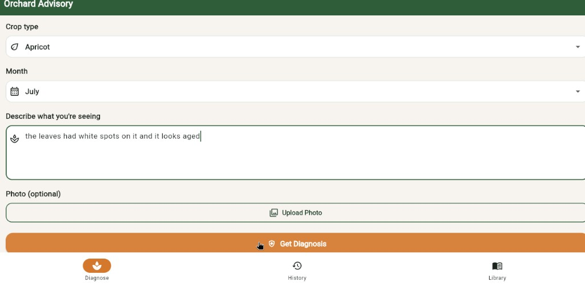
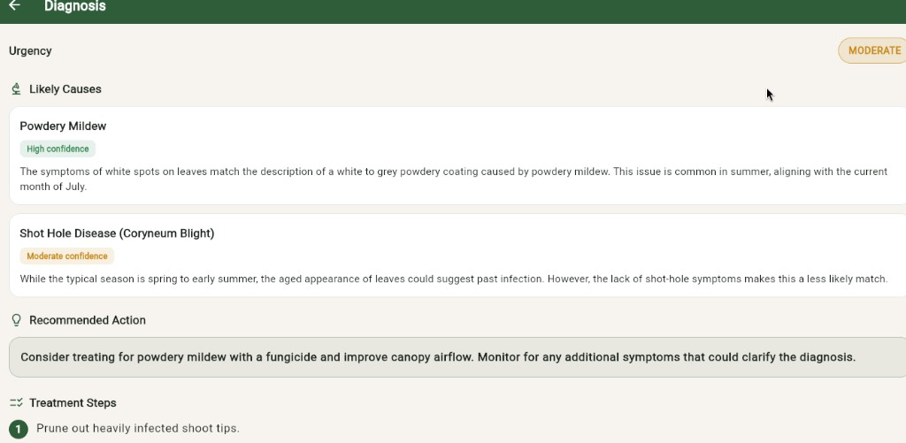
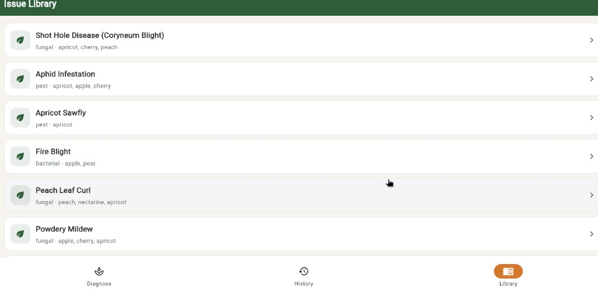
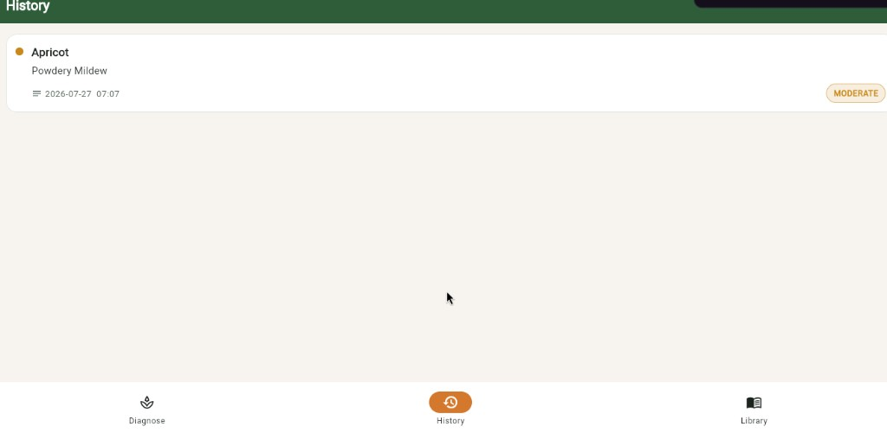

# FarmAi — Orchard Advisory Bot LIVE AT (https://alibarkat726.github.io/Farm_Ai/)

An AI-powered diagnostic tool that helps fruit growers in **Gilgit-Baltistan, Pakistan** identify diseases, pests, and nutritional problems in their **apricot, apple, and cherry** orchards. A farmer describes symptoms in plain text and/or uploads a photo of an affected leaf, fruit, or branch — the app returns a structured, actionable diagnosis grounded in a curated local knowledge base of 20 real orchard issues specific to high-altitude temperate climates.

## The Problem

Gilgit-Baltistan is one of Pakistan's most important fruit-growing regions, yet farmers in remote valleys often lack timely access to agricultural extension officers. A diseased tree can go weeks without correct diagnosis, leading to crop loss, wasted sprays, or the spread of fast-moving infections like fire blight. **Orchard Advisory Bot** puts a first-response diagnostic tool directly in the farmer's pocket — available instantly, in the field, even with just a phone browser.

---

## Live App

**[https://alibarkat726.github.io/Farm_Ai/](https://alibarkat726.github.io/Farm_Ai/)**

_(Flutter web app hosted on GitHub Pages, calling a FastAPI backend on Vercel)_

---

## Features

| Feature | Description |
|---------|-------------|
| **Text-based diagnosis** | Describe symptoms, pick crop type and month — get ranked likely causes with confidence levels |
| **Image-based diagnosis** | Upload a photo of the affected plant part; the AI describes what it sees before matching to the knowledge base |
| **Ranked likely causes** | Each diagnosis returns 1–3 candidates ranked by confidence (high / moderate / low) with detailed reasoning |
| **Treatment steps** | Numbered, actionable treatment steps pulled directly from the knowledge base — no hallucinated remedies |
| **Urgency indicator** | Color-coded urgency badge (low / moderate / high / critical) so farmers know how fast to act |
| **Extension office referral** | For severe or unclear cases (e.g. suspected fire blight), the app explicitly recommends consulting a local agriculture office |
| **Seasonal awareness** | The AI weighs the current month against each disease's typical season and flags unusual timing |
| **Issue Library** | Browse all 20 seeded orchard problems — symptoms, treatment, prevention — even without running a diagnosis |
| **Diagnosis History** | View recent past diagnoses with crop, date, cause summary, and urgency |
| **Responsive web UI** | Warm, outdoor-legible design with large tap targets, built for field use on a phone browser |

---

## Screenshots

### Diagnose Screen
_Select crop, month, describe symptoms, optionally upload a photo, and tap "Get Diagnosis"._



### Diagnosis Result
_AI returns ranked likely causes with confidence badges, a recommended action, and numbered treatment steps._



### Issue Library
_Browse the full knowledge base of 20 orchard diseases, pests, and nutritional issues._



### Diagnosis History
_Review past diagnoses with urgency indicators and timestamps._



---

## AI Feature — How It Works

The backend sends the farmer's input (crop type, symptoms, month, and optionally a base64-encoded image) to **OpenAI's GPT-4o** model along with the full local knowledge base (20 entries) and a carefully designed system prompt.

### System Prompt (used for every diagnosis)

```
You are an orchard diagnostic assistant for fruit growers in Gilgit-Baltistan,
Pakistan, specializing in apricot, apple, and cherry trees.

You will be given: the crop type, a symptom description and/or an uploaded photo,
the current month, and a JSON knowledge base of known orchard issues (each with
symptoms, typical season, treatment, and prevention).

Rules:
1. Ground every diagnosis in the provided knowledge base. Do not invent diseases,
   pests, or treatments not present in the knowledge base unless the symptoms
   clearly don't match anything — in that case, say so honestly.
2. Weigh the current month against each candidate issue's typicalSeason — flag
   if a symptom is unusual for the current season.
3. If an image is provided, describe what you visually observe before matching it
   to knowledge base entries.
4. Rank likely causes by confidence (high/moderate/low). Include at least the top
   1–3 candidates when the picture is ambiguous.
5. Never recommend a treatment not listed in the matched knowledge base entry.
6. If symptoms suggest a severe, fast-spreading, or unclear issue (e.g. possible
   fire blight), recommend consulting a local agricultural extension office.
7. If an image is unclear, use low confidence and ask a clarifying question rather
   than guessing.
8. Output ONLY valid JSON matching the required schema.
```

### Why this prompt matters

- **Grounding** — forces the AI to use only verified treatments from the knowledge base, not hallucinated advice
- **Seasonal context** — a symptom in April means something different than the same symptom in September
- **Honesty over confidence** — the AI is told to say "I don't know" rather than force a bad match
- **Safety net** — severe cases trigger a "consult your extension office" flag instead of DIY treatment

### Knowledge Base

The backend includes `data/orchard_issues.json` with **20 real, researched orchard problems** covering:

> Shot hole disease, aphid infestation, apricot sawfly, fire blight, peach leaf curl, powdery mildew, fruit drop (water stress), fruit drop (late frost), codling moth, brown rot, San Jose scale, bacterial canker, root rot, sunscald/bark damage, hail damage, nitrogen deficiency, iron chlorosis, spider mite infestation, apple scab, and cherry fruit fly.

Each entry includes symptoms, typical season, conditions that favor it, treatment steps, prevention, urgency level, and notes specific to the Gilgit-Baltistan region.

---

## Tech Stack

### Backend (`orchard-advisory-backend/`)

| Tool / Service | Role |
|----------------|------|
| **Python 3.11+** | Language |
| **FastAPI** | REST API framework |
| **Uvicorn** | ASGI server |
| **OpenAI API** (GPT-4o) | AI model for text + image diagnosis |
| **SQLAlchemy** + SQLite | Diagnosis history logging |
| **Pydantic** | Request/response validation |
| **Vercel** | Serverless deployment |

### Frontend (`orchard_advisory_app/`)

| Tool / Service | Role |
|----------------|------|
| **Flutter** (Dart) | Cross-platform UI framework |
| **Provider** | State management |
| **http** package | API calls to the backend |
| **image_picker** | Camera and gallery photo selection |
| **GitHub Pages** | Static web hosting |
| **GitHub Actions** | CI/CD — builds Flutter web and deploys to Pages |

### AI Model

| Model | Provider | Why |
|-------|----------|-----|
| **GPT-4o** | OpenAI | Supports text + image input in a single call (multimodal); strong at structured JSON output; fast enough for a field-use tool |

---

## Project Structure

```
FarmAi/
├── orchard-advisory-backend/       # FastAPI backend
│   ├── app/
│   │   ├── main.py                 # App entry, CORS, routes
│   │   ├── config.py               # Environment variable loading
│   │   ├── ai_client.py            # OpenAI prompt construction + parsing
│   │   ├── knowledge_base.py       # Loads orchard_issues.json
│   │   ├── models.py               # SQLAlchemy DiagnosisLog model
│   │   ├── schemas.py              # Pydantic request/response schemas
│   │   ├── database.py             # DB engine/session
│   │   └── routes/
│   │       ├── diagnose.py         # POST /diagnose
│   │       ├── diagnose_image.py   # POST /diagnose-image
│   │       ├── issues.py           # GET /issues, GET /issues/{id}
│   │       └── history.py          # GET /history
│   ├── data/
│   │   └── orchard_issues.json     # 20-entry knowledge base
│   ├── api/index.py                # Vercel serverless entrypoint
│   ├── vercel.json                 # Vercel config
│   ├── requirements.txt
│   └── .env.example
├── orchard_advisory_app/           # Flutter frontend
│   ├── lib/
│   │   ├── main.dart
│   │   ├── config.dart             # API_BASE_URL from --dart-define
│   │   ├── theme.dart              # Orchard color palette
│   │   ├── models/                 # DiagnosisResult, HistoryItem, Issue
│   │   ├── services/api_service.dart
│   │   ├── providers/diagnose_provider.dart
│   │   ├── screens/                # Diagnose, Result, History, Issues, HomeShell
│   │   └── widgets/badges.dart
│   └── pubspec.yaml
├── .github/workflows/
│   └── deploy-pages.yml            # Flutter web → GitHub Pages CI/CD
├── render.yaml                     # Alternative Render deploy
├── DEPLOY.md                       # Step-by-step deploy guide
└── README.md                       # This file
```

---

## How to Run Locally

### Prerequisites

- Python 3.11+
- Flutter SDK (stable channel)
- An [OpenAI API key](https://platform.openai.com/api-keys)

### 1. Backend

```bash
cd orchard-advisory-backend
python -m venv .venv
source .venv/bin/activate        # Windows: .venv\Scripts\activate
pip install -r requirements.txt
cp .env.example .env             # then edit .env and add your OPENAI_API_KEY
uvicorn app.main:app --reload --host 0.0.0.0 --port 8000
```

Backend is now running at **http://127.0.0.1:8000** — try http://127.0.0.1:8000/docs for interactive API docs.

### 2. Frontend (web)

```bash
cd orchard_advisory_app
flutter pub get
flutter run -d chrome --dart-define=API_BASE_URL=http://127.0.0.1:8000
```

### Environment Variables (backend)

| Variable | Required | Default | Description |
|----------|----------|---------|-------------|
| `OPENAI_API_KEY` | Yes | — | OpenAI API key |
| `OPENAI_MODEL` | No | `gpt-4o` | Model (must support vision for image diagnosis) |
| `DATABASE_URL` | No | `sqlite:///./orchard.db` | SQLAlchemy DB URL |
| `ALLOWED_ORIGINS` | No | `*` | CORS origins |

### API Endpoints

| Method | Endpoint | Description |
|--------|----------|-------------|
| `POST` | `/diagnose` | Text-only symptom diagnosis |
| `POST` | `/diagnose-image` | Image + optional text diagnosis |
| `GET` | `/issues` | List all knowledge base entries |
| `GET` | `/issues/{id}` | Full detail for one issue |
| `GET` | `/history?limit=20` | Recent diagnosis logs |
| `GET` | `/health` | Health check |

---

## Deployment

| Component | Platform | URL |
|-----------|----------|-----|
| Backend | Vercel | Set via `API_BASE_URL` variable |
| Frontend | GitHub Pages | [https://alibarkat726.github.io/Farm_Ai/](https://alibarkat726.github.io/Farm_Ai/) |

For full deployment instructions (Vercel setup, GitHub Pages config, env variables), see **[DEPLOY.md](./DEPLOY.md)**.

---

## Author

**Ali Barkat** — [github.com/alibarkat726](https://github.com/alibarkat726)
